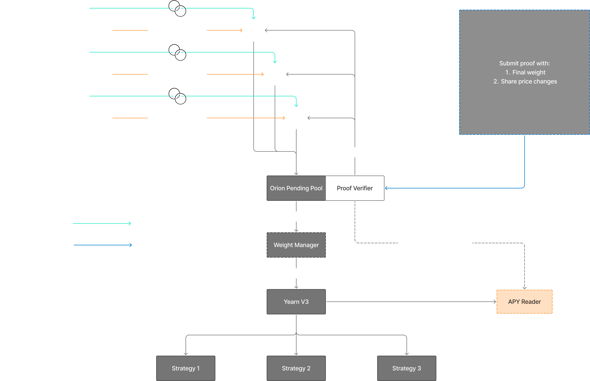

# Privacy

## Why Privacy Matters for Portfolio Managers

DeFi today is *transparent by default* — which is [powerful, but often limiting](https://www.zama.ai/post/stablecoin-next-chapter-built-in-confidentiality-with-fully-homomorphic-encryption).

In particular, **vault curation** of public, blockchain-based DeFi products is one of the most promising business models for the next generation of finance. However, its scalability and long-term sustainability are limited by a fundamental issue: the need for portfolio managers to protect their alpha.

In today's DeFi environment, **vault tokenization standards** expose real-time portfolio compositions and trading behaviors. **Copycats and freeloaders** can easily monitor, reverse-engineer, and replicate strategies without bearing the associated research and execution costs.

Without privacy, managers interested in avoiding liquidity fragmentation are forced into an impossible trade-off between:
- Sharing all their moves and risking the loss of their edge, or
- Operating off-chain, undermining the auditability and composability of DeFi.

If DeFi is to scale professional asset management, **confidentiality must become a first-class primitive** — just as composability, security, and permissionlessness already are.

### Our Commitment to Onchain Privacy

Through innovations like **confidential smart contracts**, Orion enables:
- **Protection of proprietary strategies** without sacrificing onchain composability;
- **Private portfolio management** with verifiable, encrypted performance;
- **Auditability for users and LPs** without exposing sensitive manager behavior: vault strategies remain private, with holdings and trades encrypted, while performance remains auditable.
- **MEV protection**, safeguarding trade execution against frontrunning and sandwich attacks;
- **Users to deposit into vaults** without revealing their positions or allocations.

By integrating confidential computing natively into our architecture, Orion brings **institutional-grade privacy** to the **permissionless world of DeFi** — unlocking a new era of scalable, professionalized, and competitive onchain asset management.

### Confidential Smart Contracts: A Key Enabler

Orion integrates advancements in cryptography[^1] [^2] to power private vault strategies and encrypted performance tracking. This integration enables the execution of confidential smart contracts on encrypted data — ensuring both **data privacy** and **composability** within blockchain environments. 

Transaction inputs and on-chain states are encrypted, ensuring that sensitive information remains confidential, while **fully onchain**, **non-custodial** and **verifiable** by anyone.

## Technical Overview

Let:
- $N$ be the number of active privacy-preserving portfolios.
- $M$ be the number of distinct assets (tokens) active in the netted portfolio.
- $a_{i,j}$ denote the (encrypted) amount of asset $j$ held by portfolio $i$, where $i \in \{1, \dots, N\}$ and $j \in \{1, \dots, M\}$.

Each portfolio $i$ is defined as a vector:

$$
a_i = [a_{i,1}, \dots, a_{i,M}] \quad\forall \medspace i \in \{1, \dots, N\}
$$

where entries are encrypted amounts associated with a whitelisted investment universe shared by every portfolio (i.e., the union of unique symbols across all portfolios).

Let:
- $A_j$ denote the total (observable) amount of asset $j$ across all portfolios.

$$
A_j = \sum_{i=1}^{N} \text{Decrypt}(a_{i,j}) \quad \forall \medspace j \in \{1, \dots, M\}
$$

These totals $A_j$ are used to compute the single, batched portfolio finally executed on-chain.

Note that we can decrypt the sum, not sum decrypted entries, using homomorphic encryption, to further minimize trust:

$$
A_j = \text{Decrypt} \left( \sum_{i=1}^{N} a_{i,j}\right) \quad \forall \medspace j \in \{1, \dots, M\}
$$

Let:
- $R_j$ be the plaintext price of asset $j$ as returned by an on-chain oracle.

The Profit and Loss of each portfolio $i$ is computed as the inner product of its holdings with the public assets return:

$$
P\&L_i = \sum_{j=1}^{M} \text{Decrypt}(a_{i,j}) \cdot R_j
$$

As above, using FHE:

$$
P\&L_i = \text{Decrypt}\left( \sum_{j=1}^{M} a_{i,j} \cdot R_j \right)
$$

### Proof

For an outside observer, the number of unknowns is $N \cdot M$ (portfolio states).

The number of equations is $M + N$ (one for each asset and one for each portfolio):

$$
\begin{cases}
\sum_{i=1}^{N} \text{Decrypt}(a_{i,j}) = A_j \quad \forall \medspace j \in \{1, \dots, M\} \\
\sum_{j=1}^{M} \text{Decrypt}(a_{i,j}) \cdot R_j = P\&L_i \quad \forall \medspace i \in \{1, \dots, N\}
\end{cases}
$$

Thus, the system is underdetermined and has infinitely many solutions if and only if:

$$
N \cdot M > M + N
$$

Which is easily satisfied for $N, M \geq 2$.

---

[^1]: [Zama - Welcome to fhEVM](https://docs.zama.ai/fhevm)
[^2]: [INCO - Confidential ERC20 Framework](https://www.inco.org/#research)