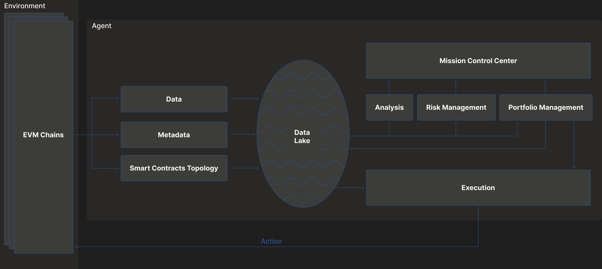

# Overview

Orion Finance is designed as a modular, permissionless protocol for onchain portfolio management. At its core, it enables the creation and execution of customizable, yield-generating vaults that support multivariate strategies and seamless composability.

## Modular Vault Architecture

Orion vaults are built around the [ERC-4626](https://eips.ethereum.org/EIPS/eip-4626) standard but extend its design to support:
- **Multi-asset portfolios**;
- **Dynamic allocation strategies**;
- **Custom vault templates** for different risk profiles.

Each vault consists of:
- **A controller**, strategy execution logic;
- **A set of whitelisted assets**;
- **Performance-tracking and reporting modules**;
- **Optional privacy-preserving layers (via fhEVM)**.

This modularity allows asset managers to deploy vaults tailored to specific risk/reward profiles.

## Machine Learning-Enabled Strategy Abstraction

A core differentiator for Orion is its ability to **abstract away complexity** using financial machine learning, allowing vault managers to:
- Optimize allocation across multiple assets;
- Minimize drawdowns;
- Adapt dynamically to market regimes;
- Provide optimization and risk management for custom strategies.

This abstraction allows everyday users to access intelligent portfolios without needing to manage or understand the strategy mechanics themselves.

## Composability and Integrations

Vaults can be used as:
- Inputs to other vaults and building blocks in more structured products: DeFi fund of funds;
- Collateral in lending protocols.

This makes Orion an ideal substrate for DeFi-native fund managers, structured product designers, or protocols seeking capital-efficient yield routing.

### On the Relation with Marketplaces

Orion integrates with existing prediction and data marketplaces to enhance strategy development and market intelligence. Some potential integrations include:

- Prediction marketplaces[^1][^2] can inform vault strategies by incorporating predictive models and agent-based forecasts;

- Data marketplaces[^3] enable vaults to leverage external data feeds for better-informed allocations and real-time market adaptation.

[^1]: [Olas Predict](https://olas.network/agent-economies/predict)
[^2]: [31 Use Cases for the Allora Network](https://medium.com/allora-network/31-use-cases-for-the-allora-network-69034608b1e8)
[^3]: [Ocean Protocol - Data Marketplaces](https://oceanprotocol.com/build/data-marketplaces/)